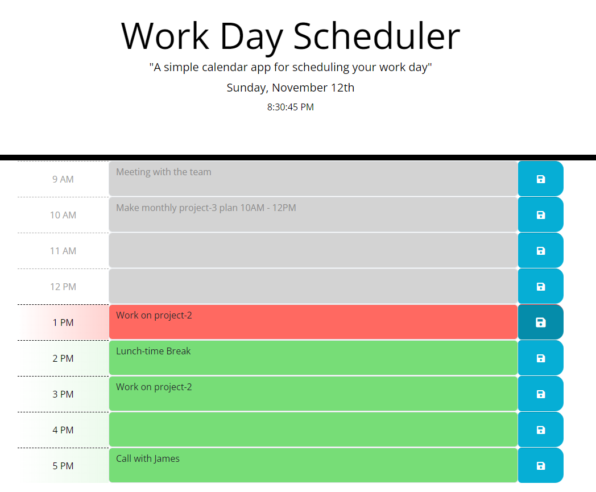

# Work Day Scheduler

This repository hosts a dynamic Work Day Scheduler, designed to help users organize their daily tasks efficiently. The scheduler provides a visual representation of the workday, allowing users to input and store information about their schedule. This information persists even if the page is refreshed or the browser is closed.

## Motivations

1. **DOM Manipulation with jQuery:** The primary focus of this project was to reinforce understanding and proficiency in event handling and DOM manipulation using jQuery.

2. **Integration of Third-Party APIs:** The project serves as a practical demonstration of incorporating third-party APIs, specifically utilizing day.js for date and time functionalities.

## Features

1. **jQuery Implementation:** The project extensively utilizes jQuery for simplifying DOM manipulation, making it more dynamic and responsive.

2. **Local Storage Integration:** User data is stored locally, allowing seamless retrieval and persistence of schedule information.

3. **Visual Time Blocks:** The scheduler dynamically creates time blocks representing each hour of the workday, color-coded to indicate past, present, and future time slots.

4. **Interactive Interface:** Users can input and save schedule details for each hour, providing a user-friendly and interactive experience.

## Problems Addressed

1. **API Integration:** The project demonstrates how to effectively integrate day.js, addressing potential challenges and ensuring smooth functionality.

2. **Dynamic Updates:** Ensuring real-time updates to the schedule and its visual representation required addressing intricacies in DOM updates.

3. **Optimizing Asynchronous Functions:** The scheduler incorporates asynchronous functions for improved responsiveness, addressing potential bottlenecks.

## Insights Gained

Throughout the development of the "Work Day Scheduler," the following technical insights and skills were acquired:

- **Event Handling:** Comprehensive understanding of event handling mechanisms and their application in a practical scenario.

- **Event Propagation/Delegation:** Efficiently managing events through propagation and delegation to enhance code organization and maintainability.

- **Persistence Strategies:** Implementation of local storage for data persistence, ensuring a seamless user experience.

- **Code Organization:** Structuring code for readability, maintainability, and scalability, emphasizing modular and well-commented code.

## Usage

Explore the "Work Day Scheduler" by visiting the deployed application [here](https://jimmygian.github.io/workday-scheduler/). Test its functionality and experience a visually intuitive way to manage your daily tasks.

## Credits

This project was conceived, developed, and is actively maintained by Dimitris Giannoulis. The GitHub repository for the project is available [here](https://github.com/jimmygian/workday-scheduler/).

## License

This project is licensed under the MIT License, granting users the freedom to use and modify the code for their own projects. Feel free to customize and adapt it to your specific needs.

## Links

- Deployed Application: [Work Day Scheduler](https://jimmygian.github.io/workday-scheduler/)
- GitHub Repository: [Work Day Scheduler Repository](https://github.com/jimmygian/workday-scheduler/)

Enjoy using "Work Day Scheduler" for enhanced productivity!
